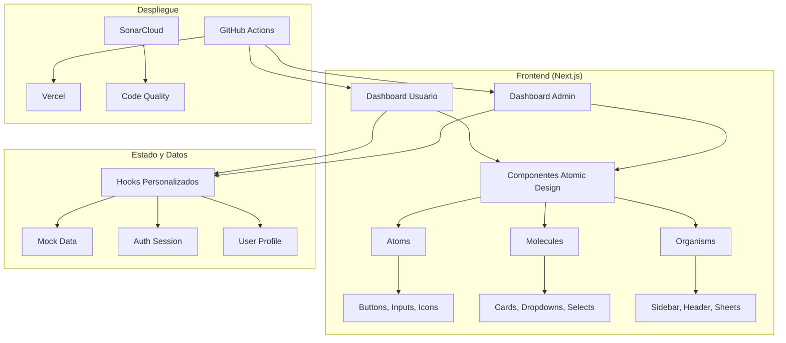
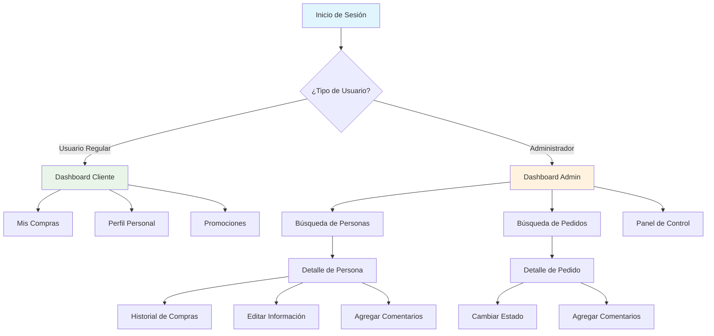
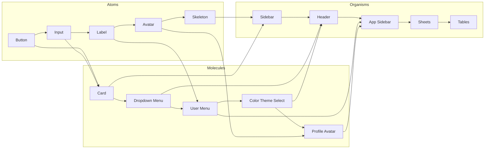
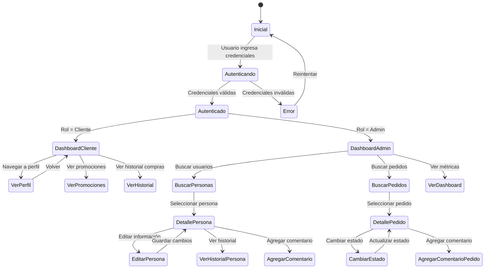
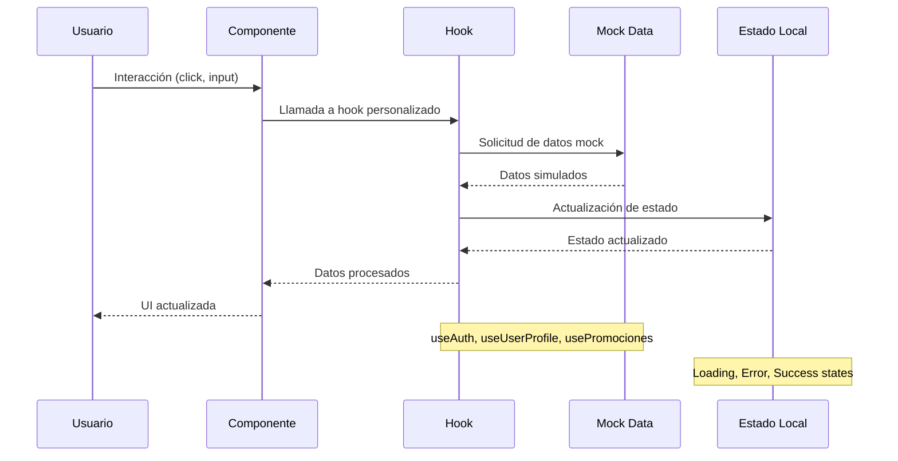

<!-- Badges -->
<p align="center">
  <a href="https://sonarcloud.io/summary/new_code?id=davidc-garciae_CourierSync">
    
    
    
    
    
    
  </a>
</p>

# Dashboard Administrativo Next.js + Tailwind (Atomic Design)

Este proyecto es un dashboard administrativo avanzado construido con Next.js 15, TypeScript y Tailwind CSS, siguiendo la metodología Atomic Design. Presenta una arquitectura escalable para gestión de usuarios, pedidos, promociones y análisis de satisfacción, con una experiencia de usuario moderna, accesibilidad mejorada y despliegue automático.

## Tabla de Contenidos

- [Arquitectura y Funcionamiento](#arquitectura-y-funcionamiento)
- [Características](#características)
- [Estructura del Proyecto](#estructura-del-proyecto)
- [Instalación](#instalación)
- [Uso y Flujos Principales](#uso-y-flujos-principales)
- [Despliegue Automático](#despliegue-automático)
- [Contribución](#contribución)
- [Licencia](#licencia)

## Arquitectura y Funcionamiento

### Arquitectura General del Sistema



### Flujo de Navegación del Usuario



### Arquitectura de Componentes (Atomic Design)



### Flujo de Gestión de Estados



### Flujo de Datos y Hooks



## Características

- **Atomic Design:** Componentes atómicos, moleculares y organismos reutilizables.
- **Gestión de usuarios y pedidos:** Búsqueda, edición, historial, comentarios y cambio de estado.
- **Sheets atómicos:** Para comentarios, edición de estado, perfil, contraseña y registro.
- **Feedback visual:** Skeletons, toasts personalizados, animaciones en íconos (Tailwind + Radix).
- **Manejo de errores diferenciado:** 404 vs. error de carga, con reintento solo cuando aplica.
- **Breadcrumbs dinámicos** y navegación clara.
- **Despliegue automático en Vercel** vía GitHub Actions.
- **Documentación clara** y estructura profesional lista para conectar a backend real.

## Estructura del Proyecto

- `src/components/atoms/`: Elementos básicos (botones, inputs, íconos, skeletons, etc.)
- `src/components/molecules/`: Combinaciones de átomos (select, sidebar, cards, etc.)
- `src/components/organisms/`: Sheets, tablas, sidebar, header, etc.
- `src/app/`: Rutas y layouts principales (admin, dashboard, etc.)
- `.github/workflows/`: Workflows de CI/CD para despliegue automático.

## Instalación

### Prerrequisitos

- Node.js (v14 o superior)
- npm o pnpm

### Pasos

1. Clona el repositorio:
   ```
   git clone <repository-url>
   ```
2. Entra al directorio del proyecto:
   ```
   cd CourierSync
   ```
3. Instala las dependencias:
   ```
   npm install
   # o
   pnpm install
   ```

## Uso y Flujos Principales

- Inicia el servidor de desarrollo:
  ```
  npnm run dev
  ```
  Accede a `http://localhost:3000`.
- Explora el dashboard administrativo, busca usuarios/pedidos, edita estados, agrega comentarios y navega entre perfiles.
- Sheets reutilizables para edición y comentarios.
- Feedback visual inmediato y manejo de errores robusto.

## Despliegue Automático

- El proyecto se despliega automáticamente en Vercel usando GitHub Actions (`.github/workflows/deploy-vercel.yml`).
- **Secrets requeridos:**
  - `VERCEL_TOKEN`: Token de acceso de Vercel.
  - `VERCEL_ORG_ID` y `VERCEL_PROJECT_ID`: IDs de organización y proyecto en Vercel.
- Configura estos secrets en tu repositorio para habilitar el despliegue automático.

## Contribución

- Forkea el repositorio y envía un Pull Request.
- Sigue la estructura atómica y las buenas prácticas del proyecto.
- (Opcional) Agrega tests automáticos o integra con un backend real.

## Licencia

MIT. Ver archivo LICENSE.

---

### Información adicional

- El sheet de información general (`AppInfoSheet`) en la pantalla de inicio explica el estado de desarrollo y credenciales de prueba.
- Los íconos y animaciones están personalizados para una mejor experiencia visual.
- El proyecto está listo para escalar y conectar a servicios reales.
